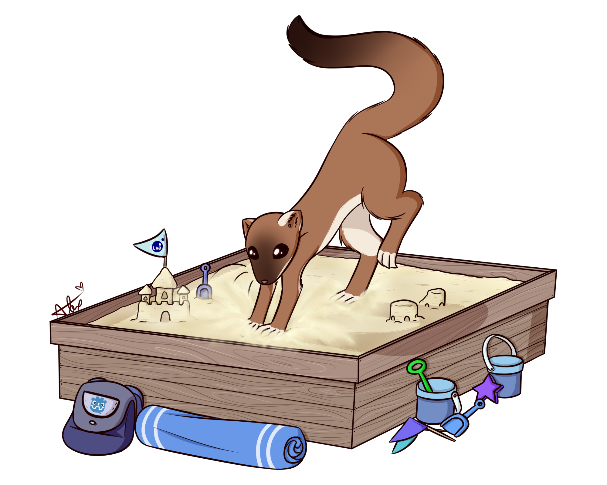

# Home

## Godot LuaAPI V1.1-stable

<figure markdown>  
  
  <figcaption>Art created by <a href="https://www.instagram.com/redheadalex1" target="_blank">Alex</a></figcaption>
</figure>

This is a Godot engine module that adds Lua API support via GDScript. Importantly this is **NOT** meant to be a replacement for or alternative to GDScript. This module provides no functionality to program your game out of the box. This module allows you to create custom modding API's in a sandboxed environment. You have control of what people can and can not do within that sandbox.

To use you can either [Compile from source](getting_started/installation#compiling-from-source) or you can download one of the [releases](https://github.com/WeaselGames/godot_luaAPI/releases).

By default the Lua print function is set to print to the GDEditor console. This can be changed by exposing your own print function as it will overwrite the existing one.

**Some things to note**, this is not the only way to support Modding in your game. It's also not the only way to support Lua Modding in your game. In fact, using this mod to create your Modding API will likely take a lot more work than using native scripts for Modding. However, the advantage using luaAPI over native scripts is that the Lua code is sandboxed. No one can access parts of the engine that you don't explicitly give access to.

If you are looking to make your game using Lua or would like to support Modding without worrying about a sandbox, check out one of these projects:

- [luascript](https://github.com/perbone/luascript) by [perbone](https://github.com/perbone)
- [godot-lua-pluginscript](https://github.com/gilzoide/godot-lua-pluginscript) by [gilzoide](https://github.com/gilzoide)
   

## Features

- Run lua directly from a string or a text file.
- Push any Variant as a global.
- Expose GDScript functions to lua with a return value and up to 5 arguments.
- Call lua functions from GDScript.
- By default the lua print function is set to print to the GDEditor console. This can be changed by exposing your own print function as it will overwrite the existing one.
- Basic types are passed as userdata (currently: Vector2, Vector3 and Color) with a useful metatable.

If a feature is missing that you would like to see feel free to create a [Feature Request](https://github.com/WeaselGames/godot_luaAPI/issues/new?assignees=&labels=feature%20request&template=feature_request.md&title=) or submit a PR.
